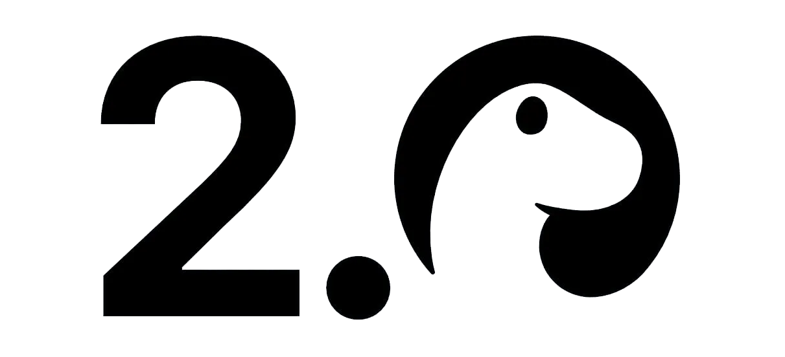

# Nuxt 3 powered by Deno 2.0



Look at the [Nuxt 3 documentation](https://nuxt.com/docs/getting-started/introduction) and [Deno documentation](https://docs.deno.com/) to learn more.

Make sure to check out the **[deno.json](deno.json)** file to see how the tasks are configured.

## Install/Upgrade Deno 2

Make sure to install deno 2.0:

```sh
curl -fsSL https://deno.land/install.sh | sh
```

If already installed upgrade to latest
```sh
deno upgrade
```

## Setup with deno 2

Clone the repository:

```sh
git clone https://github.com/TimvdEijnden/deno2-nuxt3.git
```

Make sure to install the dependencies using deno:

```sh
deno install
````

## Development Server

Start the development server on `http://localhost:3000`:

```sh
deno task dev
```

## Production build

Build the application for production:

```sh
deno task build
```

Preview the production build on `http://localhost:3000`:

```sh
deno task preview
```

No node needed al all. Just Deno.